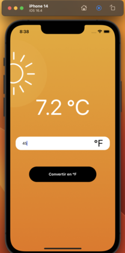
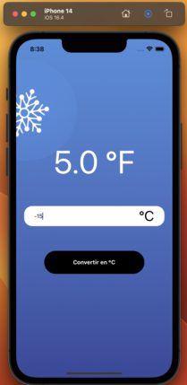
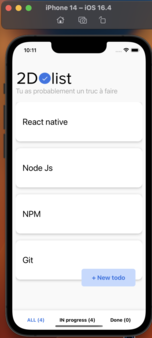
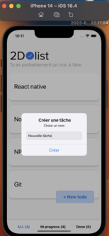

# React_native_training

## Description:

This repository includes the three course projects on react native, available on [udemy](udemy.com)

### training link :

[Here](https://www.udemy.com/course/react-native-le-guide-du-debutant)

## First project

The first project is a temperature converter

## second project

The second project is a todo list

